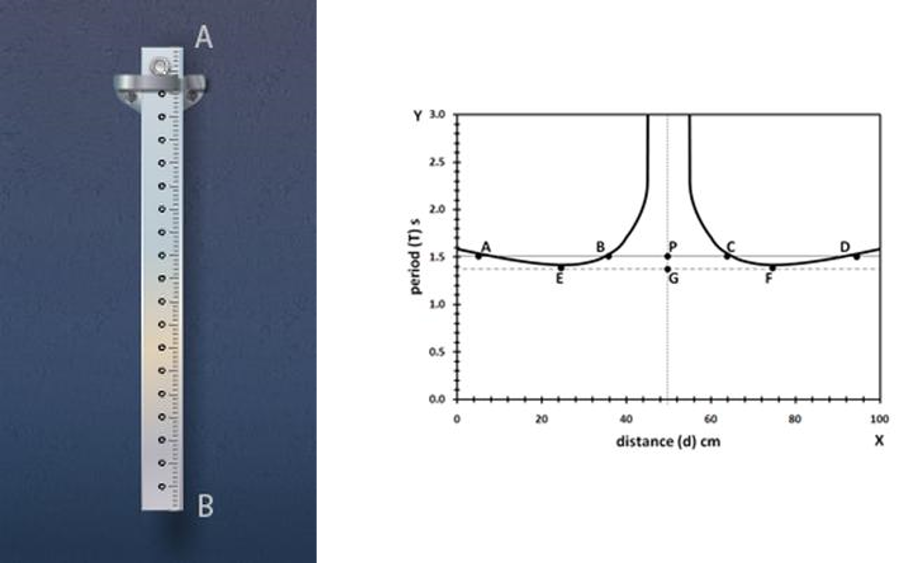

## Procedure

### Performing the real lab

The compound bar pendulum AB is suspended by passing a knife edge through the first hole at the end A.  The pendulum is pulled aside through a small angle and released, whereupon it oscillates in a vertical plane with a small amplitude. The time for 10 oscillations is measured. From this the period T of oscillation of the pendulum is determined.

In a similar manner, periods of oscillation are determined by suspending the pendulum through the remaining holes on the same side of the centre of mass G of the bar. The bar is then inverted and periods of oscillation are determined by suspending the pendulum through all the holes on the opposite side of  G. The distances d of the top edges of different holes from the end A of the bar are measured for each hole.The position of the centre of mass of the bar is found by balancing the bar horizontally on a knife edge. The mass M of the pendulum is determined by weighing the bar with an accurate scale or balance. 

A graph is drawn with the distance d of the various holes from the end A along the X-axis and the period T of the pendulum at these holes along the Y-axis. The graph has two branches, which are symmetrical about G. To determine the length of the equivalent simple pendulum corresponding to any period, a straight line is drawn parallel to the X- axis from a given period T on the Y- axis, cutting the graph at four points A, B, C, D. The distances AC and BD, determined from the graph, are equal to the corresponding length l. The average length l = (AC+BD)/2 and  l/T2 are calculated. In a similar way , l/T2 is calculated for different periods by drawing lines parallel to the X-axis from the corresponding values of T along the Y- axis. l/T2 should be constant over all periods T, so the average over all suspension points is taken. Finally, the acceleration due to gravity is calculated from the equation g= 4π2(l/T2).

Tmin is where the tangent EF to the two branches of the graph crosses the Y-axis. At Tmin, the distance EF = l = 2kG can be determined, which gives us kG, the radius of gyration of the pendulum about its centre of mass, and one more value of g, from g= 4π2(2kG/Tmin2).

kG can also be determined as follows. A line is drawn parallel to the Y -axis from the point G corresponding to the centre of mass on the X-axis, crossing the line ABCD at P. The distances AP = PD = AD/2 = h and BP = PC = BC/2 = h² are obtained from the graph. The radius of gyration kG about the centre of mass of the bar is then determined by equation (4). The average value of kG over the different measured periods T is taken, and the moment of inertia of the bar about a perpendicular axis through its centre of mass is calculated using the equation IG=MkG2.

### Performing the simulation:

Suspend the pendulum in the first hole by choosing the length 5 cm on the **length** slider.
 
Click on the lower end of the pendulum, drag it to one side through a small angle and release it. The pendulum will begin to oscillate from side to side.
 
Repeat the process by suspending the pendulum from the remaining holes by choosing the corresponding lengths on the length slider.
 
Draw a graph by plotting distance d along the X-axis and time period T along the Y-axis. (A spreadsheet like Excel can be very helpful here.)
 
Calculate the average value of  l/T2 for the various choices of T, and then calculate g as in step 2 above.
 
Determine kG and IG as outlined in steps 3 and 4 above.
 
Repeat the experiment in different gravitational environments by selecting an environment from the drop-down **environment** menu. If the pendulum has been oscillating, press the **Stop** button to activate the environment menu.

## Observations

To find the value of 'g' : 

 

### To find the radius of gyration and the acceleration of gravity (step 3 above):
 
Radius of gyration about the centre of mass kG = EF/2 = ..................

Acceleration of gravity, g= 4π2(2kG/Tmin2) = ......................

### To find the radius of gyration (step 4 above):

## Result
Average acceleration of gravity, g= 4π2(l/T2) = ..................  m/s2   

Average radius of gyration of the pendulum about its centre of mass, kG =  ..................  m

Mass of the pendulum M =  ..................  Kg

Moment of inertia of the pendulum about its centre of mass, IG=MkG2 =  ..................  Kgm2       
